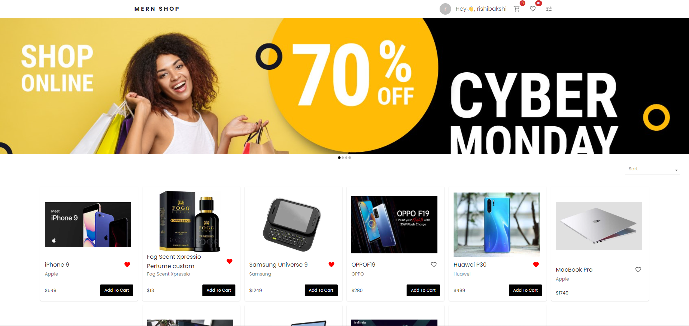

## Kalash Fashion

Kalash Fashion is a full-stack ecommerce application for browsing, ordering, and managing products with separate user and admin experiences. Built on the MERN stack (MongoDB, Express, React, Node) with Redux Toolkit and Material UI.



## Features

### User
- Product browsing, search, and sorting
- Cart and checkout flow
- Wishlist
- Order history
- Profile and address management
- Reviews

### Admin
- Product management (add, update, soft delete)
- Order management and status updates
- Dashboard metrics

### Security
- Auth with JWT and cookies
- OTP verification and password reset

## Tech Stack
- Frontend: React, Redux Toolkit, Material UI
- Backend: Node.js, Express
- Database: MongoDB

## Project Setup

### Prerequisites
- Node.js (v21.1.0 or later)
- MongoDB running locally

### Install dependencies
Frontend:
```bash
cd frontend
npm install
```

Backend:
```bash
cd backend
npm install
```

## Environment Variables

### Backend (`backend/.env`)
```bash
MONGO_URI="mongodb://localhost:27017/kalash-fashion"
ORIGIN="http://localhost:3000"

EMAIL="your-email@example.com"
PASSWORD="your-email-password"

LOGIN_TOKEN_EXPIRATION="30d"
OTP_EXPIRATION_TIME="120000"
PASSWORD_RESET_TOKEN_EXPIRATION="2m"
COOKIE_EXPIRATION_DAYS="30"

SECRET_KEY="your-secret-key"
PRODUCTION="false"

# Razorpay (optional for UPI demo)
RAZORPAY_KEY_ID="your_test_key_id"
RAZORPAY_KEY_SECRET="your_test_key_secret"
```

### Frontend (`frontend/.env`)
```bash
REACT_APP_BASE_URL="http://localhost:8000"
REACT_APP_RAZORPAY_KEY_ID="your_test_key_id"
```

## Run the App

Backend:
```bash
cd backend
npm run dev
```

Frontend:
```bash
cd frontend
npm start
```

Access:
- Frontend: http://localhost:3000
- Backend: http://localhost:8000

## Seeding Demo Data
```bash
cd backend
npm run seed
```

## Admin Access
Create or reset an admin user:
```bash
cd backend
npm run create-admin -- admin@example.com YourPassword@123
```

Then sign in and open:
```
/admin/dashboard
```

## Notes
- Do not commit `.env` files.
- In production, set `PRODUCTION="true"` and use secure cookies.
